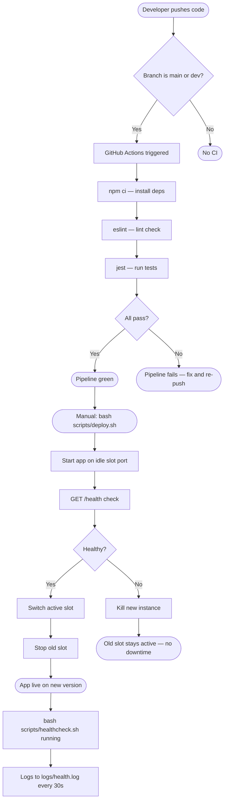
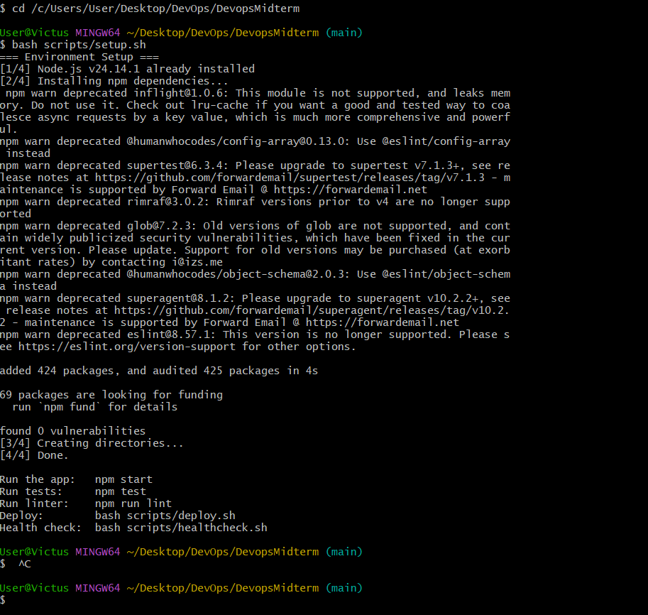
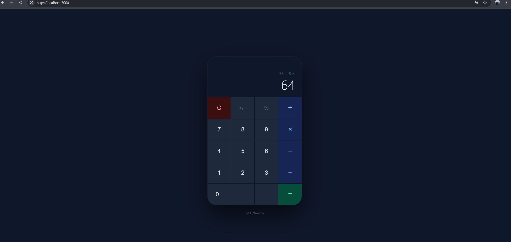
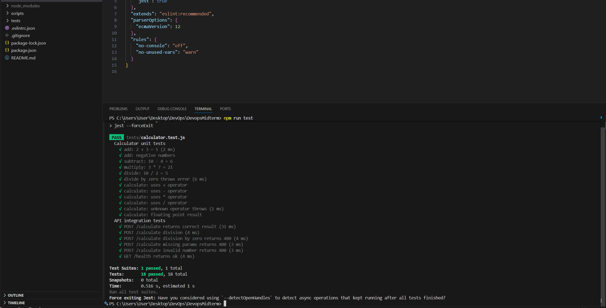
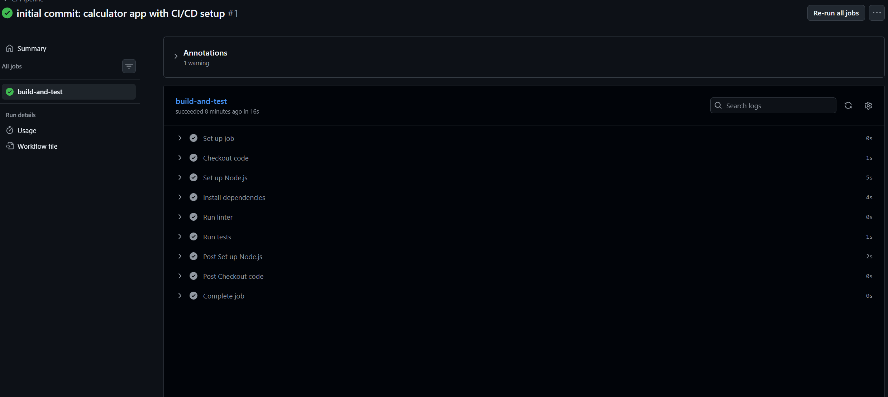
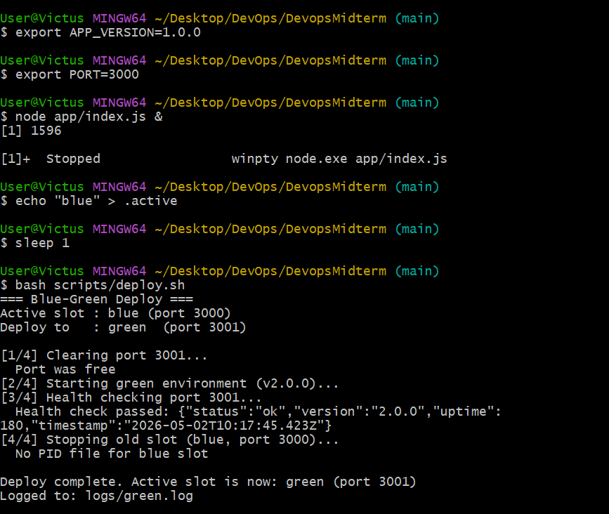
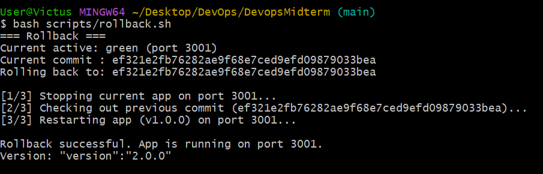
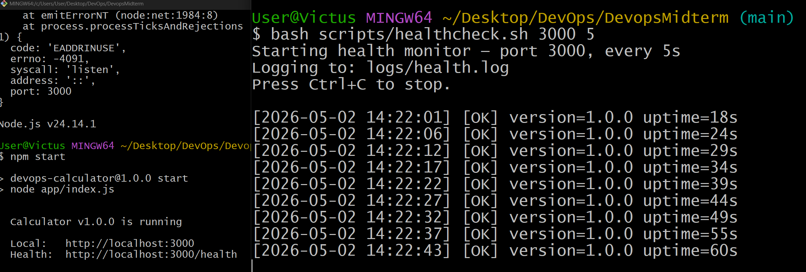

# DevOps Midterm — Calculator App

A small but complete calculator web application built to demonstrate a full DevOps workflow: version control, CI, infrastructure automation, blue-green deployment, and monitoring.

---

## Tech Stack

| Area | Tool |
|---|---|
| Web framework | Node.js + Express |
| Testing | Jest + Supertest |
| Linting | ESLint |
| CI | GitHub Actions |
| IaC / Automation | Bash (`scripts/setup.sh`) |
| CD / Deployment | Bash (`scripts/deploy.sh`) |
| Rollback | Bash (`scripts/rollback.sh`) |
| Monitoring | Bash (`scripts/healthcheck.sh`) |
| Version control | Git (branches: `main`, `dev`) |

---

## Project Structure

```
.
├── app/
│   ├── index.js          # Express server (routes: POST /calculate, GET /health)
│   ├── calculator.js     # Pure math functions (add, subtract, multiply, divide)
│   └── public/
│       └── index.html    # Calculator UI (calls /calculate via fetch)
├── tests/
│   └── calculator.test.js  # Unit + integration tests (Jest + Supertest)
├── scripts/
│   ├── setup.sh          # IaC — installs Node.js, dependencies, creates dirs
│   ├── deploy.sh         # Blue-green deployment
│   ├── rollback.sh       # Reverts to previous deployment
│   └── healthcheck.sh    # Periodic health monitoring + logging
├── .github/
│   └── workflows/
│       └── ci.yml        # GitHub Actions pipeline
├── .eslintrc.json
├── .gitignore
└── package.json
```

---

## Workflow Diagram



---

## Step-by-Step Setup Guide

### Prerequisites

- Linux or WSL (Windows Subsystem for Linux) — deployment scripts use Bash
- Git
- Internet connection (for Node.js install if missing)

### 1. Clone the repository

```bash
git clone <your-repo-url>
cd devops-calculator
```

### 2. Run the automated environment setup (IaC)

This single command installs Node.js if needed, installs all dependencies, and creates required directories:

```bash
bash scripts/setup.sh
```

Expected output:
```
=== Environment Setup ===
[1/4] Node.js v18.x.x already installed
[2/4] Installing npm dependencies...
[3/4] Creating directories...
[4/4] Done.
```

> **Screenshot — IaC execution:**
> 
> 

### 3. Run the app locally

```bash
npm start
```

Open `http://localhost:3000` in your browser. Enter two numbers, pick an operation, click Calculate.

> **Screenshot — Running app:**
>
> 

### 4. Run the tests

```bash
npm test
```

Runs 18 tests: 12 unit tests for the calculator logic and 6 integration tests for the API endpoints.

> **Screenshot — Test output:**
>
> 

### 5. Run the linter

```bash
npm run lint
```

---

## CI Pipeline (GitHub Actions)

The pipeline lives in `.github/workflows/ci.yml`. It triggers automatically on every push and pull request to `main` or `dev`.

**Steps:**
1. Checkout code
2. Set up Node.js 18
3. `npm ci` — clean install
4. `npm run lint` — ESLint check
5. `npm test` — Jest test suite

To trigger it: push any commit or open a PR against `main` or `dev`. The Actions tab in GitHub shows the result.

> **Screenshot — CI pipeline run:**
>
> 

---

## Blue-Green Deployment

Two slots, two ports:

| Slot | Port |
|---|---|
| Blue | 3000 |
| Green | 3001 |

The `.active` file tracks which slot is currently live. The deploy script starts the idle slot, health-checks it, then cuts over and shuts down the old one — zero-downtime swap.

### Deploy a new version

```bash
bash scripts/deploy.sh
```

Example output (first deploy, blue → green):
```
=== Blue-Green Deploy ===
Active slot : blue (port 3000)
Deploy to   : green (port 3001)

[1/4] Clearing port 3001...
  Port was free
[2/4] Starting green environment...
[3/4] Health checking port 3001...
  Health check passed: {"status":"ok","version":"2.0.0",...}
[4/4] Stopping old slot (blue, port 3000)...
  Stopped PID 12345

Deploy complete. Active slot is now: green (port 3001)
```

> **Screenshot — Deploy output:**
>
> 

### Rollback

If something goes wrong, roll back to the previous version:

```bash
bash scripts/rollback.sh
```

The script reads `.prev_commit` (saved automatically on each deploy), checks out the previous app code, and restarts the server.

> **Screenshot — Rollback output:**
>
> 

---

## Monitoring & Health Check

The health check script polls `GET /health` every 30 seconds and appends results to `logs/health.log`.

### Start monitoring

```bash
bash scripts/healthcheck.sh
# or with custom port and interval:
bash scripts/healthcheck.sh 3001 10
```

### Sample output in terminal and in `logs/health.log`

```
[2026-05-02 14:00:00] [OK]   version=1.0.0 uptime=42s
[2026-05-02 14:00:30] [OK]   version=1.0.0 uptime=72s
[2026-05-02 14:01:00] [FAIL] No response (app may be down)
[2026-05-02 14:01:30] [OK]   version=2.0.0 uptime=8s
```

`OK` — app is up and healthy  
`FAIL` — app is unreachable  
`WARN` — app responded but with unexpected data

> **Screenshot — Health check log:**
>
> 

---

## API Reference

| Method | Route | Description |
|---|---|---|
| GET | `/` | Calculator UI |
| POST | `/calculate` | Perform calculation |
| GET | `/health` | Health status |

**POST /calculate — request body (JSON):**
```json
{ "a": 10, "b": 4, "op": "/" }
```

**Response:**
```json
{ "result": 2.5, "expression": "10 / 4 = 2.5" }
```

**GET /health — response:**
```json
{ "status": "ok", "version": "1.0.0", "uptime": 42, "timestamp": "..." }
```

---

## Branch Strategy

- `main` — stable, production-ready code
- `dev` — integration branch for new work

All feature work goes on `dev`, gets reviewed, then merged to `main` via PR. The CI pipeline runs on both branches.
